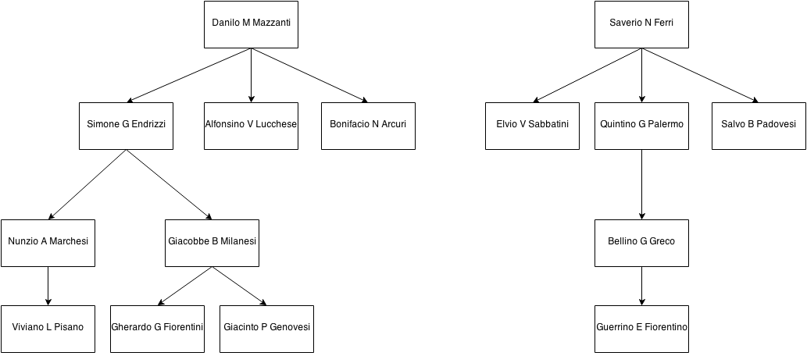

crimedb
=======

## Introduction

This is a CLI application which helps manage mafia.

To run:
    
    # Optional
    virtualenv --not-site-packages virtualenv
    source virtualenv/bin/activate
    
    # Mandatory
    pip install -r requirements.txt
    python fbi.py

After running, you will be dropped into a shell-like environment where commands can be issued to manipulate the database.

---

## Commands

This documentation can also be viewed in the shell by typing `help <command_name>`.

All example output shown below uses [this data](#sample_data) as reference.

### `find`

    Find wiseguy(s) matching query
    Usage: find [options] arg
    
    Options:
      -h, --help            show this help message and exit
      -f FIRST_NAME, --first-name=FIRST_NAME
                            Full name of agent.
      -i ID, --id=ID        ID of agent.
      -a, --all             Find all matches.
      -d, --detail          Show full detail.

Example:

	$FBI> find -f ino --all
	Quintino Palermo [4]
	Alfonsino Lucchese [6]
	Bellino Greco [11]
	Guerrino Fiorentino [15]
	Found 4 wiseguys

### `followers`

    Find the followers of a wiseguy
    Usage: followers [options] arg
    
    Options:
      -h, --help            show this help message and exit
      -i ID, --id=ID        ID of agent.
      -l LEVEL, --level=LEVEL
                            Level up to which followers are needed.
    
Example:

	$FBI> followers -i 10
	Followers of Giacobbe Milanesi [10]:
	
	Gherardo Fiorentini [13]
	Giacinto Genovesi [14]
	
	Found 2 wiseguy(s) who are followers of Giacobbe Milanesi [10].

### `compare`

	Compare N wiseguys in terms of followers. Accepts N arguments, ID of
	        each mafia you want to compare.

Example:

	$FBI> compare 1 5
	Follower counts: 
	Danilo Mazzanti [1]: 8
	Salvo Padovesi [5]: 0

### `reassign`

	Reassign a wiseguy to another boss
	Usage: reassign [options] arg
	
	Options:
	  -h, --help            show this help message and exit
	  -i ID, --id=ID        ID of agent.
	  -b BOSS, --boss=BOSS  New boss ID of agent.
	  

Example:

	$FBI> reassign -i 10 -b 8
	Done. Giacobbe Milanesi [10] has been reassigned to Bonifacio Arcuri [8]
	$FBI> tree -i 1
	Danilo Mazzanti [1]
	  +--Simone Endrizzi [3]
	  |  +--Nunzio Marchesi [9]
	  |     +--Viviano Pisano [12]
	  +--Alfonsino Lucchese [6]
	  +--Bonifacio Arcuri [8]
	     +--Giacobbe Milanesi [10]
	        +--Gherardo Fiorentini [13]
	        +--Giacinto Genovesi [14]
	
	$FBI> reassign -i 10 -b 3
	Done. Giacobbe Milanesi [10] has been reassigned to Simone Endrizzi [3]
	$FBI> tree -i 1
	Danilo Mazzanti [1]
	  +--Simone Endrizzi [3]
	  |  +--Nunzio Marchesi [9]
	  |  |  +--Viviano Pisano [12]
	  |  +--Giacobbe Milanesi [10]
	  |     +--Gherardo Fiorentini [13]
	  |     +--Giacinto Genovesi [14]
	  +--Alfonsino Lucchese [6]
	  +--Bonifacio Arcuri [8]
	 

### `decommission`

	Remove a wiseguy from active duty and set a status
	        
	Usage: decommission [options] arg
	
	Options:
	  -h, --help            show this help message and exit
	  -i ID, --id=ID        ID of agent.
	  -s STATUS, --status=STATUS
	                        New status of agent.

Example:

	$FBI> tree -i 1
    Danilo Mazzanti [1]
      +--Simone Endrizzi [3]
      |  +--Nunzio Marchesi [9]
      |  |  +--Viviano Pisano [12]
      |  +--Giacobbe Milanesi [10]
      |     +--Gherardo Fiorentini [13]
      |     +--Giacinto Genovesi [14]
      +--Alfonsino Lucchese [6]
      +--Bonifacio Arcuri [8]
    
    $FBI> decommission -i 10 -s jailed
    Done deactivating Giacobbe Milanesi [10]
    $FBI> tree -i 1
    Danilo Mazzanti [1]
      +--Simone Endrizzi [3]
      |  +--Nunzio Marchesi [9]
      |     +--Viviano Pisano [12]
      |     +--Gherardo Fiorentini [13]
      |     +--Giacinto Genovesi [14]
      +--Alfonsino Lucchese [6]
      +--Bonifacio Arcuri [8]

### `recommission`

	Reinstate a wiseguy to active duty automatically setting status to
	        active.
	        
	Usage: recommission [options] arg
	
	Options:
	  -h, --help            show this help message and exit
	  -i ID, --id=ID        ID of agent.
	  -s STATUS, --status=STATUS
	                        New status of agent.

Example (running right after decommission command shown above):

	$FBI> recommission -i 10 -s active
    Done reactivating Giacobbe Milanesi [10]
    $FBI> tree -i 1
    Danilo Mazzanti [1]
      +--Simone Endrizzi [3]
      |  +--Nunzio Marchesi [9]
      |  |  +--Viviano Pisano [12]
      |  +--Giacobbe Milanesi [10]
      |     +--Gherardo Fiorentini [13]
      |     +--Giacinto Genovesi [14]
      +--Alfonsino Lucchese [6]
      +--Bonifacio Arcuri [8]
    

### `tree`

	Draw an ASCII chart of the hierarchy under the given wiseguy.
	        
	Usage: tree [options] arg
	
	Options:
	  -h, --help      show this help message and exit
	  -i ID, --id=ID  ID of agent.

Example:

	$FBI> tree -i 1
	    Danilo Mazzanti [1]
	      +--Simone Endrizzi [3]
	      |  +--Nunzio Marchesi [9]
	      |  |  +--Viviano Pisano [12]
	      |  +--Giacobbe Milanesi [10]
	      |     +--Gherardo Fiorentini [13]
	      |     +--Giacinto Genovesi [14]
	      +--Alfonsino Lucchese [6]
	      +--Bonifacio Arcuri [8]

### `heir`

    Check who is next in line to a wiseguy to inherit followers
            
    Usage: heir [options] arg
    
    Options:
      -h, --help      show this help message and exit
      -i ID, --id=ID  ID of agent.

Example:

	$FBI> heir -i 10
	Heir to Giacobbe Milanesi [10] is:
		 Nunzio Marchesi [9]
	 
	 
### `boss`

    Check the boss of a given wiseguy
            
    Usage: boss [options] arg
    
    Options:
      -h, --help      show this help message and exit
      -i ID, --id=ID  ID of agent.
    
    
    
    
----

### Design Approach

Consider the following sample mafia data (all the above examples also use the same data):

…to be completed… 
